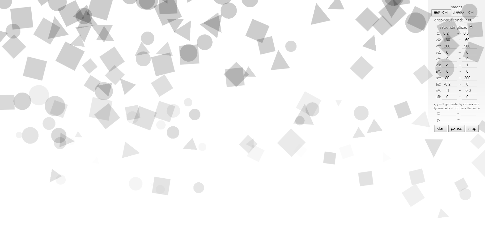

# DroppingCanvas

[Demo](https://gwokhov.github.io/dropping-canvas/demo/index.html)



## Introduction

💧 DroppingCanvas is a physics tool which can help you generate random motive image object simply on canvas. It is inspired by [sprinkler](https://github.com/axelpale/sprinkler), and DroppingCanvas also provide more flexible and modern APIs.

## Install

```shell
npm install dropping-canvas
# or
yarn add dropping-canvas
```

or just include the compiled file to your page:

```html
<script src="./dropping.js"></script>
```

## Get Started

Just a few code to run:

```javascript
var canvas = document.getElementById('canvas')
var images = ['./images/1.png', './images/2.png', './images/3.png']
var droppingCanvas = new DroppingCanvas(canvas, images)

droppingCanvas.start()
```

If you want to modify the motion of objects, you can pass an option as param to the constructor or use method `updateOptions`. For exmple:

```javascript
...
var options = {
  dropPerSecond: 15,
  r: 2,
  vY: [200, 400],
  aA: [-0.2, -0.1]
}
// for more options check Option Properties

var droppingCanvas = new DroppingCanvas(canvas, images, options)
...
```

Now the vertical speed is in the range of 200-400 (random).

For more options, you can see the [Demo](https://gwokhov.github.io/dropping-canvas/demo/index.html) or check below 👇.

## Option Properties

| Property       | Type                | Description                                                                                                        | Default            |
| -------------- | ------------------- | ------------------------------------------------------------------------------------------------------------------ | ------------------ |
| dropPerSecond  | Number, String      | Number of objects generate in a second.                                                                            | 20                 |
| isBoundingSize | Boolean             | Restrict the object rebound when z(size) is negative.                                                              | true               |
| x              | null, Array, Number | (Range of) initial horizontal position. `null`: object will generate randomly in the range of canvas width.        | null               |
| y              | null, Array, Number | (Range of) initial vertical position. `null`: object will generate over the top of canvas.(cal the maximum radius) | null               |
| z              | Array, Number       | (Range of) initial size(scale).                                                                                    | [0.2 , 0.3 ]       |
| a              | Array, Number       | (Range of) initial transparency(alpha).                                                                            | a: [1 , 1 ]        |
| r              | Array, Number       | (Range of) initial rotation.                                                                                       | [0 , 2 * Math .PI] |
| vX             | Array, Number       | (Range of) horizontal velocity.                                                                                    | [-60 , 60 ]        |
| vY             | Array, Number       | (Range of) vertical velocity.                                                                                      | [200 , 500 ]       |
| vZ             | Array, Number       | (Range of) scale velocity.                                                                                         | [0 , 0 ]           |
| vA             | Array, Number       | (Range of) transparency(alpha) velocity.                                                                           | [0 , 0 ]           |
| vR             | Array, Number       | (Range of) rotation velocity.                                                                                      | [-1 , 1 ]          |
| aX             | Array, Number       | (Range of) horizontal acceleration.                                                                                | [0 , 0 ]           |
| aY             | Array, Number       | (Range of) vertical acceleration.                                                                                  | [80 , 200 ]        |
| aZ             | Array, Number       | (Range of) scale acceleration.                                                                                     | [-0.3 , 0 ]        |
| aA             | Array, Number       | (Range of) transparency(alpha) acceleration.                                                                       | [-1 , -0.6 ]       |
| aR             | Array, Number       | (Range of) rotation acceleration.                                                                                  | [0 , 0 ]           |

## Methods

| Method        | Arguments                  | Description                                                                                                                                                      |
| ------------- | -------------------------- | ---------------------------------------------------------------------------------------------------------------------------------------------------------------- |
| start         |                            | Activate the animation.                                                                                                                                          |
| pause         |                            | Pause the animation.                                                                                                                                             |
| stop          | `isImmediateClean=false`   | Stop the animation. If `isImmediateClean` is `true`, objects will fade out immediately, otherwise the animation will stop after objects disappear from canvas.   |
| updateOptions | `options`, `isCover=false` | Update the physics options of object. If `isCover` is `true`, it will just update the options you pass, otherwise other options will replace by default options. |
| updateImages  | `images`                   | Update the Images of generate object. It accepts `Array`, `String`, `FileList`.                                                                                  |
